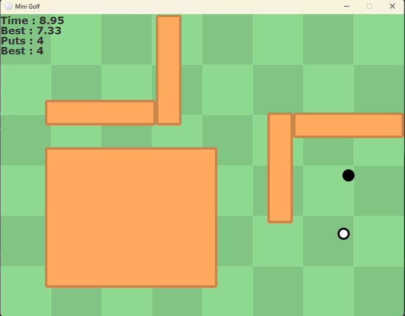

# FP-OOP2022
## Mini Golf
Nama : Ketut Arda Putra Mahotama Sadha

NRP : 5025211235

Kelas : PBO (B)

Rencana Final Project (Mini Golf)

Untuk Final Project kelas PBO ini, kiranya saya akan membuat sebuah game sederhana yaitu mini golf. Game ini akan berupa 2 dimensi top down, 
dimana Player akan berusaha memasukkan bola kedalam lubang. Game ini memiliki sekumpulan level dengan kompleksitas yang meningkat. Setiap level akan 
diberi batas Put (Satu tembakkan) dan juga timer untuk mengukur kemampuan player. Game ini akan menggunakan graphical interface JavaFX. Final Project ini akan 
mengimplementasikan semua materi perkuliahan yang telah diajarkan.

## Aspek-Aspek OOP yang digunakan
- Casting/Conversion
https://github.com/arda294/FP-OOP2022/blob/921102bd274a6543eeb96b04e7a16f85a148f382/src/Menu/PlayMenu.java#L24-L26
- Constructor
https://github.com/arda294/FP-OOP2022/blob/921102bd274a6543eeb96b04e7a16f85a148f382/src/Objects/Ball.java#L22-L37
- Overloading
https://github.com/arda294/FP-OOP2022/blob/921102bd274a6543eeb96b04e7a16f85a148f382/src/Objects/Ball.java#L39-L43
- Overriding
https://github.com/arda294/FP-OOP2022/blob/921102bd274a6543eeb96b04e7a16f85a148f382/src/Viewer/Game.java#L178-L186
- Encapsulation
https://github.com/arda294/FP-OOP2022/blob/921102bd274a6543eeb96b04e7a16f85a148f382/src/Viewer/Game.java#L29-L49
- Inheritance
https://github.com/arda294/FP-OOP2022/blob/921102bd274a6543eeb96b04e7a16f85a148f382/src/Util/Vec2d.java#L3
- Polymorphism
https://github.com/arda294/FP-OOP2022/blob/921102bd274a6543eeb96b04e7a16f85a148f382/src/Viewer/Main.java#L7-L14
- ArrayList
https://github.com/arda294/FP-OOP2022/blob/921102bd274a6543eeb96b04e7a16f85a148f382/src/Util/LevelGetter.java#L8-L21
- Exception Handling
https://github.com/arda294/FP-OOP2022/blob/921102bd274a6543eeb96b04e7a16f85a148f382/src/Util/UserDataUtil.java#L12-L21
- GUI

  
- Interface
https://github.com/arda294/FP-OOP2022/blob/921102bd274a6543eeb96b04e7a16f85a148f382/src/Viewer/View.java#L1-L12
- Abstract Class
https://github.com/arda294/FP-OOP2022/blob/921102bd274a6543eeb96b04e7a16f85a148f382/src/Util/Pair.java#L3
- Generics
https://github.com/arda294/FP-OOP2022/blob/921102bd274a6543eeb96b04e7a16f85a148f382/src/Util/Pair.java#L3-L22
- Collection
https://github.com/arda294/FP-OOP2022/blob/921102bd274a6543eeb96b04e7a16f85a148f382/src/Util/LevelGetter.java#L8-L21
- Input Output
https://github.com/arda294/FP-OOP2022/blob/921102bd274a6543eeb96b04e7a16f85a148f382/src/Objects/Ball.java#L22-L37
https://github.com/arda294/FP-OOP2022/blob/921102bd274a6543eeb96b04e7a16f85a148f382/src/Util/UserDataUtil.java#L22-L40

Video Demo : https://youtu.be/y6lnswg7fhI
## Referensi
- Building Collision Simulations: An Introduction to Computer Graphics : https://www.youtube.com/watch?v=eED4bSkYCB8
- Collision Detection Guide | Circle - Rectangle : https://www.youtube.com/watch?v=r0wAEi86vTA
- Styling FX Buttons with CSS : http://fxexperience.com/2011/12/styling-fx-buttons-with-css/
